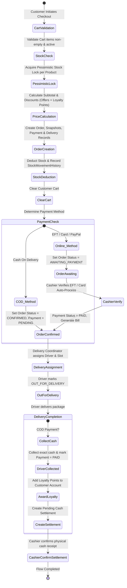

# RapidMart — Order Checkout & Delivery Activity Diagram

```mermaid
stateDiagram-v2
    [*] --> CartValidation: Customer Initiates Checkout
    CartValidation --> StockCheck: Validate Cart items non-empty & active
    StockCheck --> PessimisticLock: Acquire Pessimistic Stock Lock per Product
    PessimisticLock --> PriceCalculation: Calculate Subtotal & Discounts (Offers + Loyalty Points)
    PriceCalculation --> OrderCreation: Create Order, Snapshots, Payment & Delivery Records
    OrderCreation --> StockDeduction: Deduct Stock & Record StockMovementHistory
    StockDeduction --> ClearCart: Clear Customer Cart
    
    ClearCart --> PaymentCheck: Determine Payment Method

    state PaymentCheck {
        [*] --> COD_Method: Cash On Delivery
        [*] --> Online_Method: EFT / Card / PayPal
        COD_Method --> OrderConfirmed: Set Order Status = CONFIRMED, Payment = PENDING
        Online_Method --> OrderAwaiting: Set Order Status = AWAITING_PAYMENT
    }

    OrderAwaiting --> CashierVerify: Cashier Verifies EFT / Card Auto-Process
    CashierVerify --> OrderConfirmed: Payment Status = PAID, Generate Bill

    OrderConfirmed --> DeliveryAssignment: Delivery Coordinator assigns Driver & Slot
    DeliveryAssignment --> OutForDelivery: Driver marks OUT_FOR_DELIVERY

    OutForDelivery --> DeliveryCompletion: Driver delivers package
    state DeliveryCompletion {
        [*] --> CollectCash: COD Payment?
        CollectCash --> DriverCollected: Collect exact cash & mark Payment = PAID
        DriverCollected --> AwardLoyalty: Add Loyalty Points to Customer Account
        AwardLoyalty --> CreateSettlement: Create Pending Cash Settlement
    }

    CreateSettlement --> CashierConfirmSettlement: Cashier confirms physical cash receipt
    CashierConfirmSettlement --> [*]: Flow Completed
```
