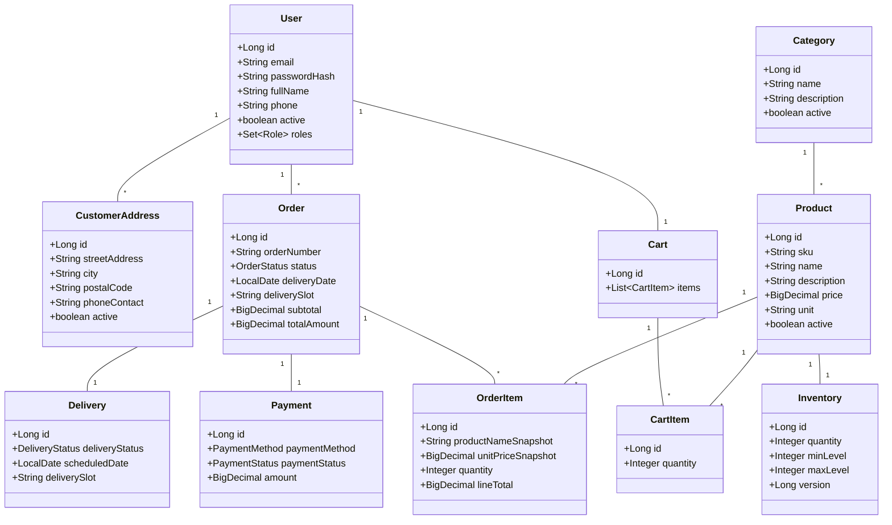

# RapidMart — Class Diagram

```mermaid
classDiagram
    class User {
        +Long id
        +String email
        +String passwordHash
        +String fullName
        +String phone
        +boolean active
        +Set~Role~ roles
    }

    class CustomerAddress {
        +Long id
        +String streetAddress
        +String city
        +String postalCode
        +String phoneContact
        +boolean active
    }

    class Category {
        +Long id
        +String name
        +String description
        +boolean active
    }

    class Product {
        +Long id
        +String sku
        +String name
        +String description
        +BigDecimal price
        +String unit
        +boolean active
    }

    class Inventory {
        +Long id
        +Integer quantity
        +Integer minLevel
        +Integer maxLevel
        +Long version
    }

    class Cart {
        +Long id
        +List~CartItem~ items
    }

    class CartItem {
        +Long id
        +Integer quantity
    }

    class Order {
        +Long id
        +String orderNumber
        +OrderStatus status
        +LocalDate deliveryDate
        +String deliverySlot
        +BigDecimal subtotal
        +BigDecimal totalAmount
    }

    class OrderItem {
        +Long id
        +String productNameSnapshot
        +BigDecimal unitPriceSnapshot
        +Integer quantity
        +BigDecimal lineTotal
    }

    class Payment {
        +Long id
        +PaymentMethod paymentMethod
        +PaymentStatus paymentStatus
        +BigDecimal amount
    }

    class Delivery {
        +Long id
        +DeliveryStatus deliveryStatus
        +LocalDate scheduledDate
        +String deliverySlot
    }

    User "1" -- "*" CustomerAddress
    User "1" -- "1" Cart
    Cart "1" -- "*" CartItem
    Product "1" -- "*" CartItem
    Product "1" -- "1" Inventory
    Category "1" -- "*" Product
    User "1" -- "*" Order
    Order "1" -- "*" OrderItem
    Product "1" -- "*" OrderItem
    Order "1" -- "1" Payment
    Order "1" -- "1" Delivery
```
