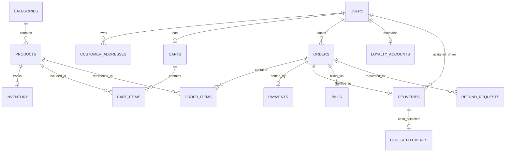

# RapidMart — Entity Relationship (ER) Diagram

```mermaid
erDiagram
    USERS ||--o{ CUSTOMER_ADDRESSES : owns
    USERS ||--o| CARTS : has
    USERS ||--o{ ORDERS : places
    USERS ||--o| LOYALTY_ACCOUNTS : maintains
    
    CATEGORIES ||--o{ PRODUCTS : contains
    PRODUCTS ||--o| INVENTORY : tracks
    PRODUCTS ||--o{ CART_ITEMS : included_in
    CARTS ||--o{ CART_ITEMS : contains

    ORDERS ||--o{ ORDER_ITEMS : contains
    PRODUCTS ||--o{ ORDER_ITEMS : referenced_in
    ORDERS ||--o| PAYMENTS : settled_by
    ORDERS ||--o| DELIVERIES : fulfilled_by
    ORDERS ||--o| BILLS : billed_via
    ORDERS ||--o{ REFUND_REQUESTS : requested_for

    DELIVERIES ||--o| COD_SETTLEMENTS : cash_collected
    USERS ||--o{ DELIVERIES : assigned_driver
```
