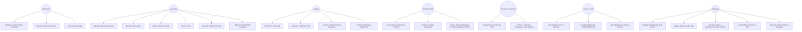

# RapidMart — System Use Case Diagram

```mermaid
graph TD
    User((Public User)) --> Browse[Browse & Search Active Catalogue]
    User --> Register[Register Customer Account]
    User --> Login[Login / Authenticate]

    Customer((Customer)) --> AddAddress[Manage Delivery Addresses]
    Customer --> Cart[Manage Cart & Items]
    Customer --> Checkout[Atomic Checkout Order]
    Customer --> ViewOrders[Track Orders]
    Customer --> RequestRefund[Request Payment Refund]
    Customer --> SubmitFeedback[Submit Product/Order Feedback]

    Cashier((Cashier)) --> VerifyEFT[Verify EFT Payments]
    Cashier --> GenBill[Generate Paid Order Bills]
    Cashier --> ProcessRefund[Approve / Reject Refund Requests]
    Cashier --> ConfirmCOD[Confirm COD Cash Settlement]

    InventoryStaff((Inventory Staff)) --> ManageProduct[Create & Soft-Deactivate Products]
    InventoryStaff --> ManageCategory[Create & Update Categories]
    InventoryStaff --> Restock[Create Restock Requests & Receive Approved Stock]

    Coordinator((Delivery Coordinator)) --> AssignStaff[Assign Driver & Delivery Slot]
    Coordinator --> HandleFailed[Process Returned Packages & Cancellations]

    Driver((Delivery Staff)) --> OutForDelivery[Mark Delivery Out For Delivery]
    Driver --> CompleteDelivery[Complete Delivery & Collect COD Cash]
    Driver --> RecordAttempt[Record Delivery Failure & Reason]

    Manager((Manager)) --> EmployeeMgmt[Manage Employees & Role Access]
    Manager --> ViewAudit[Inspect System Audit Logs]
    Manager --> GenReports[Generate Sales & Inventory Summary Reports]
    Manager --> ExportCSV[Export Sales Summary CSV]
    Manager --> ApproveRestock[Approve / Reject Restock Requests]
```
